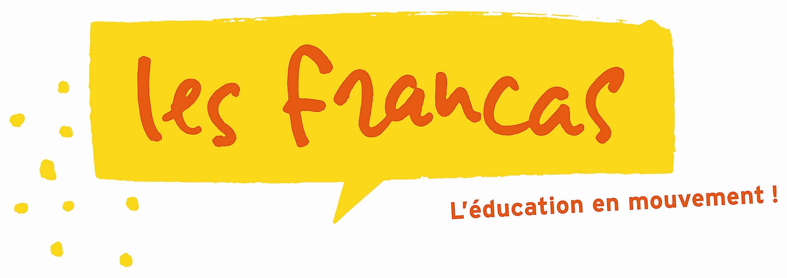

# Présentation

[fr76](https://github.com/fr76/) est le compte officiel de l'Association Départementale des Francas de Seine-Maritime.

Les Francas de Seine-Maritime est une association loi 1901 qui particicipe à l'action éducative, sociale et culturelle
en faveur des enfants.

🌐 Liens utiles :

- La page [Wikipédia](https://fr.wikipedia.org/wiki/F%C3%A9d%C3%A9ration_nationale_des_Francas) de la Fédération
  nationale des Francas.
- Notre site internet.
- Notre page [Facebook](https://www.facebook.com/francas76/).

